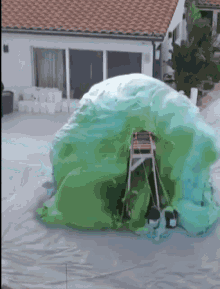

# slimeHands

Slime and hands



## Dependencies
- python3
- numpy
- opencv

## Usage
```
git clone https://github.com/eqdiag/slimeHands.git
python3 main.py
```

## Timeline

### Week 1 (Data cleaning/pre-processing)
- [x] videos2frames to get dataset
- [x] image2grayscale
- [x] align all images
- [x] resize all images to (100x100?) to start
- [x] given an image a, find the closest k images in the dataset

### Week 2 (Live stream viewer)
- [ ] little viewer program that shows closest image for a given image
- [ ] setup live video streaming from phone
- [ ] combine the littler viewer program with the live stream thing to get a viewer that gives the closet image based on the stream

### Week 3 (HARDWARE: Scrounge for stuff)
- [ ] Get wood
- [ ] Power tools + wood = box (right?)
- [ ] Cut arm holes
- [ ] Drummel indentation for screen
- [ ] Paint wood
- [ ] Get plexiglass kinda thing (for side view)
- [ ] Get a screen
- [ ] A lightbulb, so it isnt dark AF in the box
- [ ] Ugh logistics...battery powered light or not?
- [ ] If not battery, then cord...

### Week 4 (Final touches, make sure it works then polish)
- [ ] Test out code on the screen
- [ ] Add fancy stuff like flowy layers we talked about (optical flow is probably what we wanna use here)
- [ ] Install functioning screen on box
